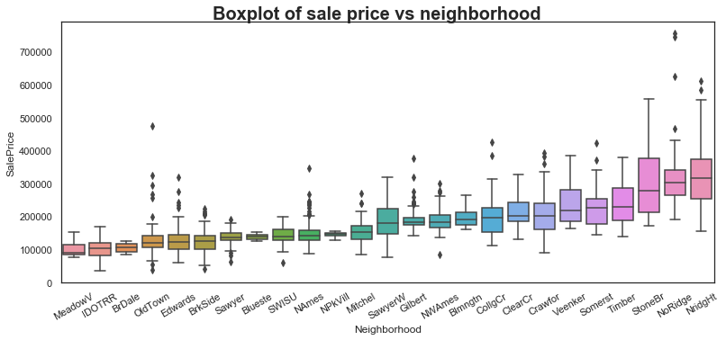
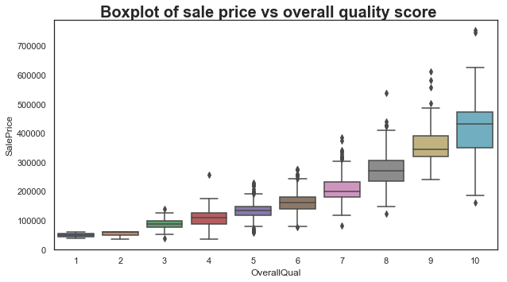
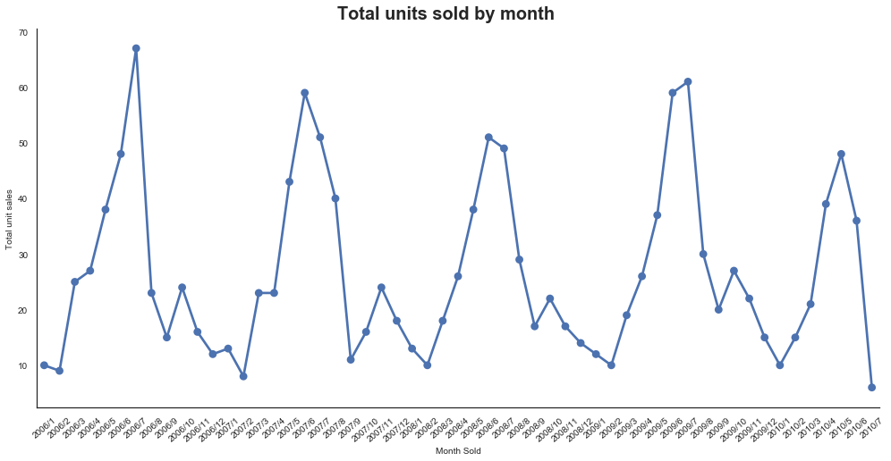

# Ames House Prices: Advanced Regression Techniques

This is an exercise to help me understand more about regression, feature engineering, data cleansing and visualization in Python.

## About the Data

With 79 explanatory variables describing (almost) every aspect of residential homes in Ames, Iowa, this competition challenges you to predict the final price of each home. The data contained the following files:

**train.csv** - the training set
**test.csv** - the test set
**data_description.txt** - full description of each column, originally prepared by Dean De Cock but lightly edited to match the column names used here
**sample_submission.csv** - a benchmark submission from a linear regression on year and month of sale, lot square footage, and number of bedrooms

Data and a more detailed description can be found [here](https://www.kaggle.com/c/house-prices-advanced-regression-techniques/data):

## About the notebooks

**Analysis.ipynb** - Some visualizations
**Predictions.ipynb** - Code to generate the predictions

## Interesting Plots

## Findings/things of note

- There appears to be a seasonal aspect to the number of houses sold
- Need to investigate why XGBoost gives a really low rmse on the training data...is it overfitting?
- Need to investigate the impact and usefulness of the polynomial features used. Have I used them correctly?

## Libraries used:

- pandas
- numpy
- scikit-learn
- matplotlib
- seaborn
- scipy
- xgboost
